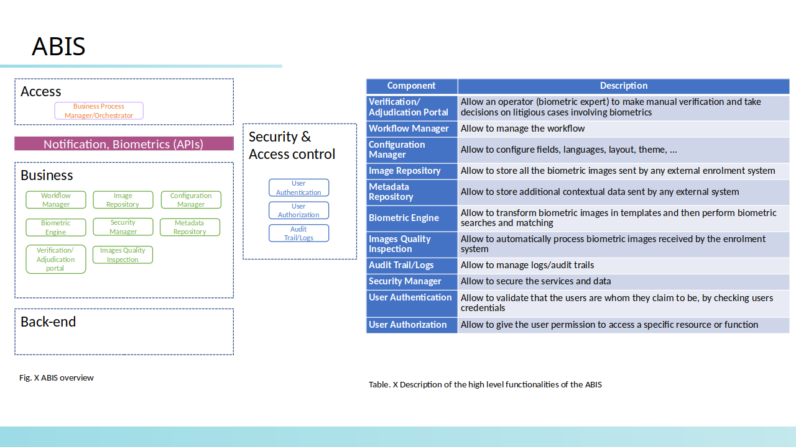

.. _chapter-bb:

===============
Building Blocks
===============

This chapter defines the interfaces that each building block MAY implement and provides an overview of the high level functionalities that each building block MAY implement.

This chapter does not define high level functionalities for the following building blocks:

* Digital Credential Issuance & Distribution System because this building block is out of scope for the current version of OSIA specification v6.1.0.
* Identity Provider because this building block is not expected to implement OSIA interfaces but rather to consume them.

.. _chapter-bb-func:

Building Blocks High Level Functionalities
------------------------------------------

The following section describes the high level functionalities that each building block MAY implement. Each building block can find many different implementations in the market while still complying with the requested functional requirements. This differentiation among products is what makes the market competitive and innovative. 

Enrollment 
""""""""""

The Enrollment building block is composed of enrollment client and enrollment server.

.. figure:: images/enrollment_client.*

    Enrollment Client overview and description of its high level functionalities

.. figure:: images/enrollment_server.*

    Enrollment Server overview and description of its high level functionalities

Biometric System (ABIS)
"""""""""""""""""""""""

    ABIS overview and description of its high level functionalities

Population Registry (PR)
""""""""""""""""""""""""

.. figure:: images/population_registry.*

    Population Registry overview and description of its high level functionalities

Civil Registry (CR)
"""""""""""""""""""

.. figure:: images/civil_registry.*

    Civil Registry overview and description of its high level functionalities

Credential Management System (CMS)
""""""""""""""""""""""""""""""""""

.. figure:: images/credential_management_system.*

    Credential Management System overview and description of its high level functionalities

Third Party Services
""""""""""""""""""""

.. figure:: images/third_party_services.*

    Third Party Service overview and description of its high level functionalities

UIN Generator
"""""""""""""

.. figure:: images/UIN_generator.*

    UIN Generator overview and description of its high level functionalities

Mapping Building Blocks vs Interfaces
-------------------------------------

The following table maps the interfaces described in :ref:`chapter-interfaces` against the building blocks described in :ref:`chapter-bb-func`.

.. table:: Mapping Building Blocks vs Interfaces Mapping
    :class: longtable
    :widths: 30 10 10 10 10 10 10 10 10
    

    =================================  ======= ======= ======= ======= ======= ======= ======= ======================
       ..                              **Building Blocks**
    ---------------------------------  ------------------------------------------------------------------------------
    **Interfaces**                     Enroll  Enroll    PR    UIN Gen  ABIS     CR      CMS    Third Party Services
                                       Clt     Srv
    =================================  ======= ======= ======= ======= ======= ======= ======= ======================
    **Notification**
    -----------------------------------------------------------------------------------------------------------------
     Subscribe                                           U                U       U       U
     List Subscription                                   U                U       U       U
     Unsubscribe                                         U                U       U       U
     Confirm                                             U                U       U       U
     Create Topic                                        U                U       U       U
     List Topics                                         U                U       U       U
     Delete Topic                                        U                U       U       U
     Publish                                             U                U       U       U
     Notify                                              I                I       I       I
    ---------------------------------  ------- ------- ------- ------- ------- ------- ------- ----------------------
    **Data Access**
    -----------------------------------------------------------------------------------------------------------------
     Read Person Attributes                       U      IU               U       IU              U
     Match Person Attributes                      U      IU                       IU              U
     Verify Person Attributes                     U      IU                       IU              U
     Query Person UIN                             U      IU                       IU              U
     Query Person List                                                            U               U
     Read Document                                U      IU                       IU              U
    ---------------------------------  ------- ------- ------- ------- ------- ------- ------- ----------------------
    **UIN Management**
    -----------------------------------------------------------------------------------------------------------------
     Generate UIN                                         U       I               U
    ---------------------------------  ------- ------- ------- ------- ------- ------- ------- ----------------------
    **Enrollment Services**
    -----------------------------------------------------------------------------------------------------------------
    Create Enrollment                     U      I
    Read Enrollment                       U      I
    Update Enrollment                     U      I
    Partial Update Enrollment             U      I
    Finalize Enrollment                   U      I
    Delete Enrollment                     U      I
    Find Enrollments                      U      I
    Send Buffer                           U      I
    Get Buffer                            U      I
    ---------------------------------  ------- ------- ------- ------- ------- ------- ------- ----------------------
    **Population Registry Services**
    -----------------------------------------------------------------------------------------------------------------
    Find Persons                                         I
    Create Person                                        I               U                U
    Read Person                                          I               U                U       U
    Update Person                                        I               U                U
    Delete Person                                        I               U                U
    Merge Persons                                        I               U
    Move Identity                                        I               U
    Create Identity                                      I
    Read Identity                                        I
    Update Identity                                      I
    Partial Update Identity                              I
    Delete Identity                                      I
    Set Identity Status                                  I
    Define Reference                                     I
    Read Reference                                       I
    Read Galleries                                       I
    Read Gallery Content                                 I
    ---------------------------------  ------- ------- ------- ------- ------- ------- ------- ----------------------
    **Biometrics**
    -----------------------------------------------------------------------------------------------------------------
    Create Encounter                             U       U                I
    Read Encounter                               U       U                I                      U
    Update Encounter                             U       U                I
    Delete Encounter                             U       U                I
    Merge Encounters                                     U                I
    Move Encounters                                      U                I
    Update Encounter Status                      U       U                I
    Update Encounter Galleries                   U       U                I
    Read Template                                U       U                I
    Read Galleries                               U       U                I
    Read Gallery Content                         U       U                I
    Identify                                     U                        I                      U
    Verify                                       U                        I                      U
    readTaskStatus                               U                        I                      U
    redeliverTaskResult                          U                        I                      U
    ---------------------------------  ------- ------- ------- ------- ------- ------- ------- ----------------------
    **Credential Services**
    -----------------------------------------------------------------------------------------------------------------
    Create Credential Request                                                             I
    Read Credential Request                                                               I
    Update Credential Request                                                             I
    Cancel Credential Request                                                             I
    Find Credentials                                                                      I
    Read Credential                                                                       I
    Suspend Credential                                                                    I
    Unsuspend Credential                                                                  I
    Revoke Credential                                                                     I
    Set Credential Status                                                                 I
    Find Credential Profiles                                                              I
    ---------------------------------  ------- ------- ------- ------- ------- ------- ------- ----------------------
    **ID Usage**
    -----------------------------------------------------------------------------------------------------------------
    Verify ID                                                                                     I
    Identify ID                                                                                   I
    Read Attributes                                                                               I
    Read Attributes set                                                                           I
    =================================  ======= ======= ======= ======= ======= ======= ======= ======================

