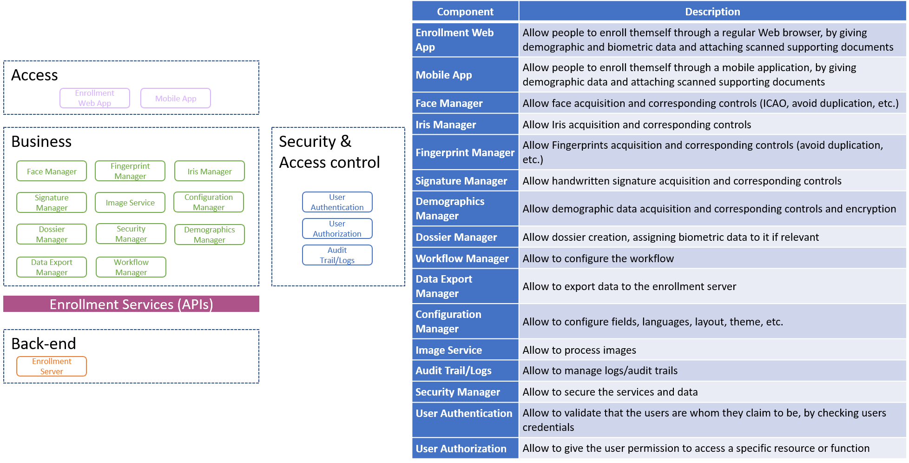
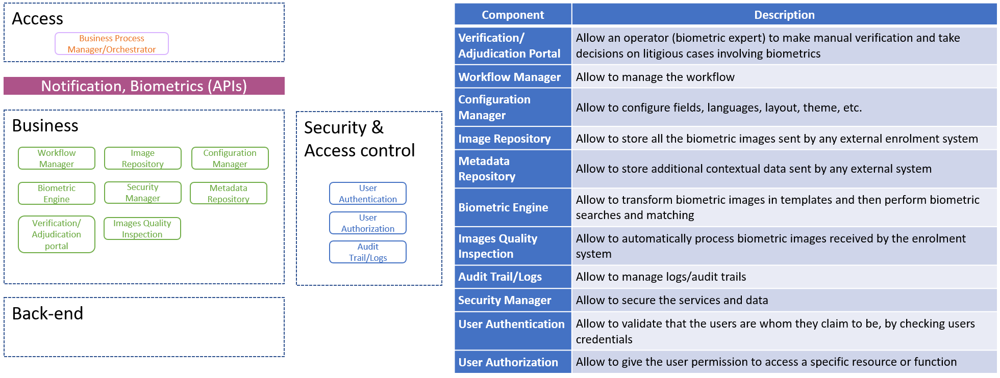
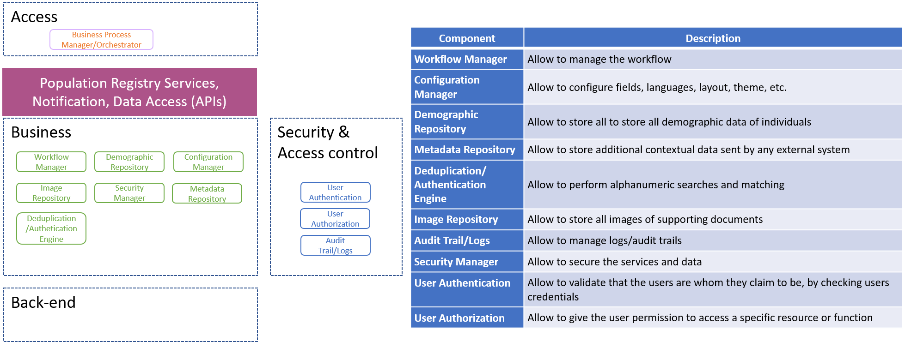
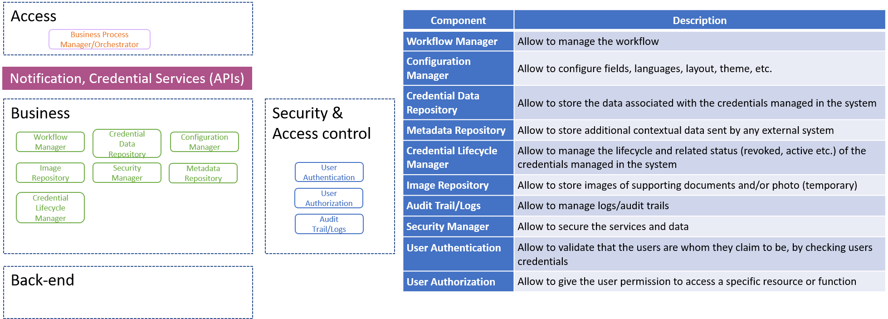
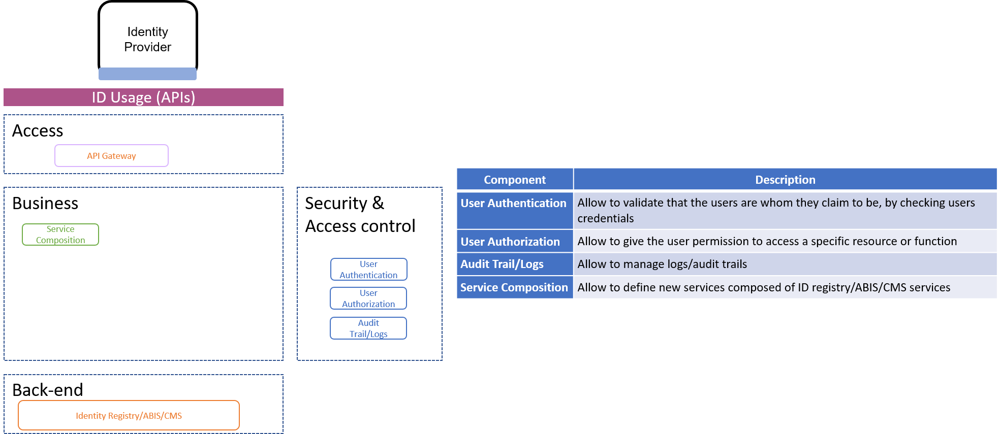

===============
Building Blocks
===============

This chapter defines the interfaces that each building block MAY implement and provides an overview of the high level functionalities that each building block MAY implement.

This chapter does not define high level functionalities for the following building blocks:

* Digital Credential Issuance & Distribution System because this building block is out of scope for the current version of OSIA specification v6.1.0.
* Identity Provider because this building block is not expected to implement OSIA interfaces but rather to consume them.

Building Blocks High Level Functionalities
------------------------------------------

The following section describes the high level functionalities that each building block MAY implement. Each building block can find many different implementations in the market while still complying with the requested functional requirements. This differentiation among products is what makes the market competitive and innovative. 

Enrollment 
""""""""""

The Enrollment building block is composed of enrolment client and enrolment server.

.. image:: images/enrollment_server.png

Biometric System (ABIS)
"""""""""""""""""""""""

Population Registry (PR)
""""""""""""""""""""""""

Credential Management System (CMS)
""""""""""""""""""""""""""""""""""

Third Party Services
""""""""""""""""""""

Mapping Building Blocks vs Interfaces
-------------------------------------

The following table maps the interfaces described in chapter 5 – Interfaces against the building blocks described in section 6.1 - Building Blocks High Level Functionalities.

.. table:: Mapping Building Blocks vs Interfaces Mapping
    :class: longtable
    :widths: 30 10 10 10 10 10 10 10 10
    

    =================================  ======= ======= ======= ======= ======= ======= ======= ======================
       ..                              **Building Blocks**
    ---------------------------------  ------------------------------------------------------------------------------
    **Interfaces**                     Enroll  Enroll    PR    UIN Gen  ABIS     CR      CMS    Third Party Services
                                       Clt     Srv
    =================================  ======= ======= ======= ======= ======= ======= ======= ======================
    **Notification**
    -----------------------------------------------------------------------------------------------------------------
     Subscribe                                           U                U       U       U
     List Subscription                                   U                U       U       U
     Unsubscribe                                         U                U       U       U
     Confirm                                             U                U       U       U
     Create Topic                                        U                U       U       U
     List Topics                                         U                U       U       U
     Delete Topic                                        U                U       U       U
     Publish                                             U                U       U       U
     Notify                                              I                I       I       I
    ---------------------------------  ------- ------- ------- ------- ------- ------- ------- ----------------------
    **Data Access**
    -----------------------------------------------------------------------------------------------------------------
     Read Person Attributes                       U      IU               U       IU              U
     Match Person Attributes                      U      IU                       IU              U
     Verify Person Attributes                     U      IU                       IU              U
     Query Person UIN                             U      IU                       IU              U
     Query Person List                                                            U               U
     Read Document                                U      IU                       IU              U
    ---------------------------------  ------- ------- ------- ------- ------- ------- ------- ----------------------
    **UIN Management**
    -----------------------------------------------------------------------------------------------------------------
     Generate UIN                                         U       I               U
    ---------------------------------  ------- ------- ------- ------- ------- ------- ------- ----------------------
    **Enrollment Services**
    -----------------------------------------------------------------------------------------------------------------
    Create Enrollment                     U      I
    Read Enrollment                       U      I
    Update Enrollment                     U      I
    Partial Update Enrollment             U      I
    Finalize Enrollment                   U      I
    Delete Enrollment                     U      I
    Find Enrollments                      U      I

    =================================  ======= ======= ======= ======= ======= ======= ======= ======================

